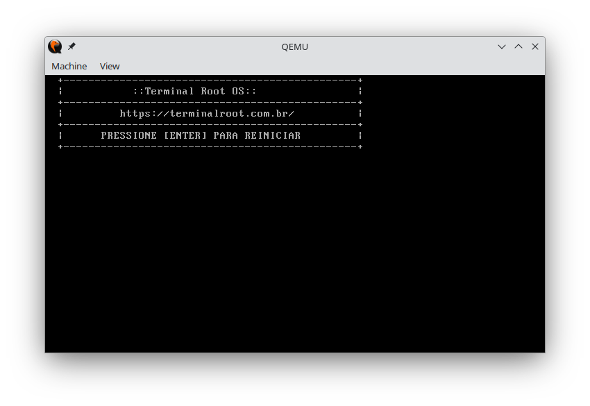

# Terminal Root OS
A basic Operating System **32-bit**, just the kernel, that prints text directly to the VGA and restarts when you press [ENTER].



## Made with C++ and GNU Assembler

---

## Dependencies
> Example on Ubuntu
```bash
sudo apt install build-essential cmake
```

Use QEMU to test. Install QEMU:
```bash
sudo apt install qemu-kvm
```

---

## Compiling and testing

Compiling:
```bash
make
```

Testing:
```bash
qemu-system-i386 -kernel terminal-root-os.bin
```

If you want to add to a GRUB Legacy (does not work in UEFI):
> Edit: `sudo vim /boot/grub/grub.cfg`

Add new line:
```bash
### BEGIN TERMINALROOTOS

menuentry 'Terminal Root OS' {
  multiboot /boot/terminal-root-os.bin
  boot
}

### END TERMINALROOTOS
```

---

[Watch video](https://terminalroot.com.br/)
